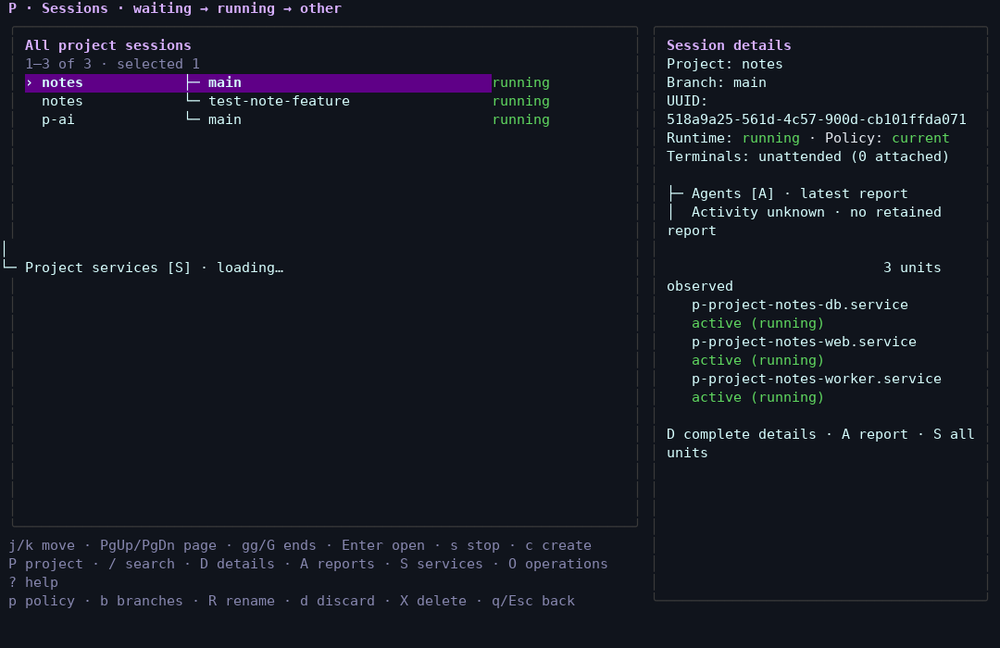
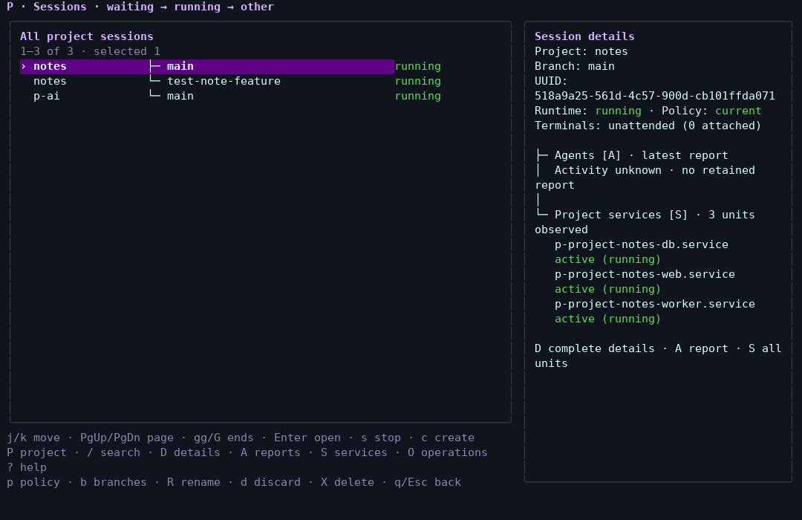

# VM serial-console redraw review — 2026-10-01

The unchanged public lab reproduced the reported corruption: services text
appeared at column zero in the sessions panel, and moving the selection left
old UUID/service fragments behind. The corrected `just lab-public` kept the
same persistent disk and rendered those updates in the right panel.

These are **interactive LLM review** captures. The LLM inspected rendered
screens and chose the next action between captures. Automated tests are
reported separately below; screenshots do not turn this review into an
integration test.

## Before and after

Unchanged VM, 120×35: the services loading line escapes the details panel.

Corrected VM, 120×35: the same Notes main session, UUID and three active
services stay in the details panel.

Changing the selection also stays clean:
[before](before-native/0005-broken-selection-before.png),
[after, including loading](after-native/0004-fixed-selection-loading.png).

## What changed

QEMU enabled host terminal output processing with `ONLCR`. That translated
guest LF cursor movements into CRLF, moving redraw fragments back to column
zero. The shared interactive console wrapper clears `ONLCR` before QEMU saves
its terminal settings, forwards cancellation to the child, and restores the
original settings after exit. Both interactive launchers use it.

The observer previously disabled output processing repeatedly. That hid this
production defect from earlier captures. It now leaves output modes untouched.
The native before run used an observation helper with the recurring correction
removed; QEMU restored newline translation and reproduced the defect. The
corrected run used the unchanged, faithful production observer.
The before action log also includes an initial launch that failed on the lab
lock and was closed before retrying; accepted reproduction starts with the
second launch. Its two initial command captures include a literal newline
escape corrected before the accepted native screen.

## Reviewed tasks and scope

| Task | Rendered evidence | Result |
| --- | --- | --- |
| Current prototype at 120×35 / 80×24 / 48×16 | [wide](prototype/0001-start.png), [stacked](prototype/0003-prototype-80.png), [compact](prototype/0004-prototype-48.png) | Comparison baseline; simulated data |
| Unchanged production mock | [wide](before-mock/0002-normal-before.png), [80×24](before-mock/0008-before-80.png), [48×16](before-mock/0009-before-48.png) | Direct local rendering was clean; this did not reproduce the VM defect |
| Ready and loading selections in real VM | [ready](after-native/0003-fixed-native-120.png), [loading](after-native/0004-fixed-selection-loading.png) | No leaked UUIDs, service text or stale fragments |
| Empty feature-branch services | [empty](after-native/0006-fixed-services-ready.png) | Empty state and Back remain readable |
| Three real Notes services and database journal | [inventory](after-native/0009-fixed-main-services.png), [journal](after-native/0010-fixed-service-journal.png) | All three units active; clean journal and Back |
| Enter, command, detach, repeated entry | [readiness transition](after-native/0013-fixed-session-enter.png), [HTTP/database health](after-native/0014-fixed-session-health.png), [detach](after-native/0016-fixed-detach.png), [re-entry](after-native/0017-fixed-reenter.png) | Actual tmux terminal; ready app/database; clean picker restoration |
| Native 80×24 and complete details | [stacked](after-native/0021-fixed-native-80.png), [details](after-native/0022-fixed-details-80.png) | Bounded overview; full UUID/services reachable through D |
| Native 48×16 and details scrolling | [compact](after-native/0026-fixed-native-48.png), [details](after-native/0027-fixed-details-48.png), [scroll](after-native/0028-fixed-details-scroll-48.png) | Controls and scrollable content remain aligned |
| Injected service-inventory error in disposable mock | [failure](after-mock-error/0003-fixed-service-error.png), [Back](after-mock-error/0004-fixed-error-back.png) | Diagnostic readable; unavailable actions disabled; Back returns to picker |

The native disk was `.cache/p-vm/demo-public/disk.qcow2`; it was not reset.
Existing `notes/main`, `notes/test-note-feature` and `p-ai/main` were preserved.
The only application command was a read-only health query. No notes, source
edits, service mutations or lifecycle removals were performed.

Serial-console sizing still requires matching the observer and guest tty:
the LLM returned to the guest shell, resized the observer, ran `stty`, and
reopened the TUI. This is not evidence of automatic guest resize propagation.
Intermediate captures show selected handoff states, not every emitted frame.

The first post-change mock error injection was consumed by background service
polling before Services opened. Its [normal inventory frame](after-mock/0003-fixed-mock-service-error.png)
does not establish error acceptance despite its provisional label. The second
run injected the fault immediately before the chosen Services key; its
[injection record](after-mock-error/injection.json) and error frame above
establish the actual feedback review. Neither mock run proves native failure
handling or native service effects.

## Separate automated checks

- The actual `just lab-public` packaged build passed Go checks and all 36
  Python unit tests, including six real-PTY console tests.
- After the native interactive review, `just tui-tests` passed all 29 tests:
  eight terminal tests, nine observer tests and twelve mock integration tests.
  [Complete test output](tui-tests.log).
- ShellCheck, Bash syntax and `git diff --check` passed.
- An independent agent reviewed code, reran the six console and nine observer
  tests, and inspected the native before/after frames: zero remaining findings.
  Signal forwarding was corrected during that review. The session's new-agent
  limit required reusing an existing agent; this was independent review, not
  a new fresh-context review.

The [checkpoint](checkpoint.json) binds builds, source hashes, actions and
scope. Each capture directory contains its PNGs, cell JSON, plain text, raw
ANSI and `actions.ndjson`. Both reviewed VMs powered off normally (exit zero),
all owned observers closed, and the public lab lock was released. Relaunch
with `just lab-public`; no reset is required.
